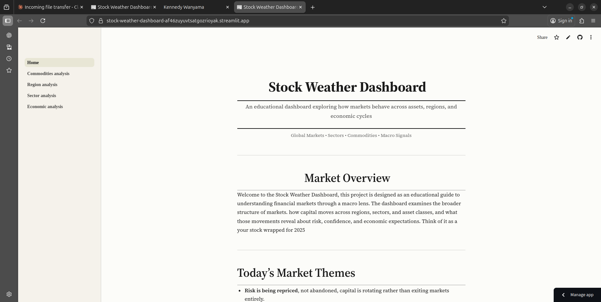
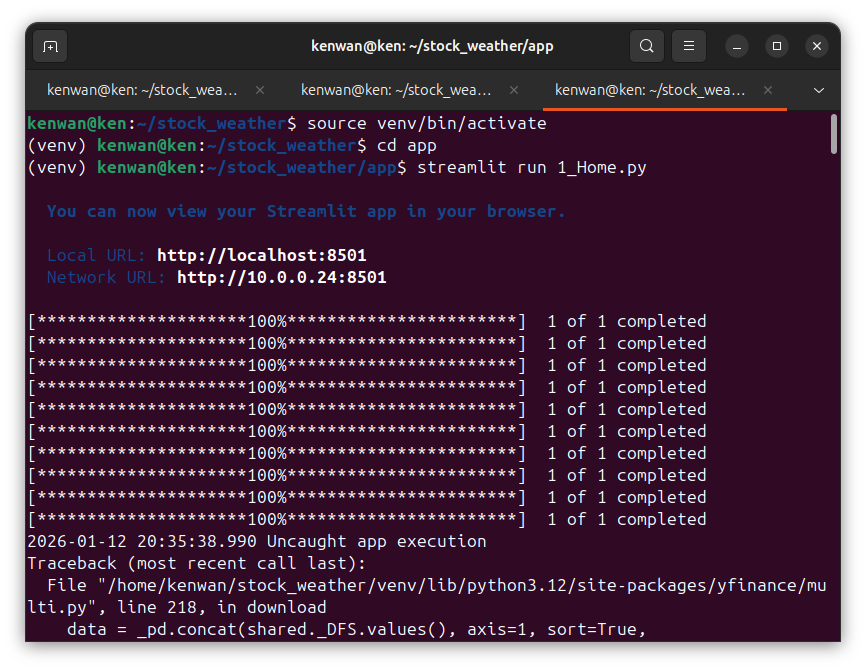

# Stock Weather Dashboard



An educational dashboard exploring how financial markets behave across assets, regions, and economic cycles throughout 2025. Built with Python and Streamlit, this project provides a newspaper-style interface for analyzing commodities, regional markets, sector performance, and macroeconomic indicators.

## Features

- **Commodities Analysis**: Track gold, oil, metals, agricultural products, and the USD Dollar Index with correlation heatmaps and normalized comparisons
- **Regional Markets**: Monitor seven major global equity indices with performance comparisons, volatility analysis, and cross-market correlations
- **Sector Performance**: Analyze U.S. market sectors using ETF data with cumulative returns, volatility metrics, and trend signals
- **Economic Indicators**: Visualize key macroeconomic data from FRED including CPI, unemployment, Fed Funds Rate, GDP, and more
- **Newspaper Theme**: Clean, paper-inspired UI using Georgia serif fonts and minimal color palette

## Live Demo

Visit the live application: [Stock Weather Dashboard](https://stock-weather-dashboard-af46zuyuvtsatgozrioyak.streamlit.app/)

## Installation

### 1. Clone the Repository

```bash
git clone <your-repo-url>
cd stock-weather-dashboard
```

### 2. Set Up Python Environment

On Linux, create a virtual environment:

```bash
python3 -m venv venv
source venv/bin/activate
```

### 3. Install Dependencies

```bash
pip install -r requirements.txt
```

### 4. Configure Environment Variables

Create a `.env` file in the project root:

```bash
touch .env
```

Add your FRED API key:

```
FRED_API_KEY=your_api_key_here
```

## Dependencies

Key libraries used in this project:

- `streamlit` - Web application framework
- `yfinance` - Yahoo Finance market data
- `fredapi` - Federal Reserve Economic Data API
- `pandas` - Data manipulation
- `matplotlib` - Data visualization
- `seaborn` - Statistical visualizations
- `numpy` - Numerical computing
- `python-dotenv` - Environment variable management

Full list available in `requirements.txt`

## Project Structure

```
stock-weather-dashboard/
│
├── 1_Home.py                      # Main landing page
├── pages/
│   ├── 2_Commodities_analysis.py  # Commodities dashboard
│   ├── 3_Region_analysis.py       # Regional markets dashboard
│   ├── 4_Sector_analysis.py       # Sector performance dashboard
│   └── 5_Economic_analysis.py     # Economic indicators dashboard
│
├── commodities.py                 # Commodity data functions
├── region_data.py                 # Regional market data functions
├── sector_data.py                 # Sector data functions
├── economic_conditions.py         # Economic data functions
├── theme.py                       # UI theme configuration
│
├── requirements.txt               # Python dependencies
├── .env                          # Environment variables (not in repo)
└── README.md                     # This file
```

## Running the Application

### Local Development

From the project root directory:

```bash
streamlit run 1_Home.py
```

The application will open in your default browser at `http://localhost:8501`


## Data Sources

- **Market Data**: Yahoo Finance via `yfinance`
- **Economic Indicators**: Federal Reserve Economic Data (FRED)
- **Time Period**: January 1, 2025 - December 31, 2025

### Tracked Assets

**Commodities**: Gold, Crude Oil (WTI), Brent Oil, Natural Gas, Silver, Copper, Corn, Wheat, Bitcoin, USD Dollar Index

**Regional Indices**: S&P 500, STOXX 600, FTSE 100, Nikkei 225, Shanghai Composite, Nifty 50, MSCI Emerging Markets

**Sectors**: Technology, Energy, Financials, Healthcare, Consumer Discretionary, Industrials, Utilities, Materials, Real Estate, Communication

**Economic Indicators**: CPI, Core CPI, Unemployment Rate, Fed Funds Rate, GDP, PCE, 10-Year Treasury Yield, Industrial Production, Retail Sales

## Design Philosophy

The dashboard adopts a newspaper aesthetic to present financial data as an editorial narrative rather than just raw analytics


## Linux Development Notes



This project was developed on Linux, which offers several advantages:


- **Native Python support**: Python 3 comes pre-installed on most distributions
- **Package management**: Easy dependency installation via pip
- **Terminal efficiency**: Quick iteration with command-line tools
- **Deployment compatibility**: Streamlit Cloud runs on Linux containers

### Linux-Specific Setup

If you encounter permission issues installing packages:

```bash
# Use --user flag for user-level installation
pip install --user -r requirements.txt

# Or ensure venv ownership
sudo chown -R $USER:$USER venv/
```

## Contributing

This is an educational project. Contributions, suggestions, and feedback are welcome

## Disclaimer

This dashboard is purely educational and descriptive. It is not intended to provide financial advice, investment recommendations, or trading signals. All analysis examines historical data for learning purposes only. Always consult qualified financial professionals before making investment decisions.

## Acknowledgments

- Data providers: Yahoo Finance, Federal Reserve Economic Data (FRED)
- Built with [Streamlit](https://streamlit.io/)
- Inspired by traditional newspaper layouts and financial journalism

---

**Built on Linux**
